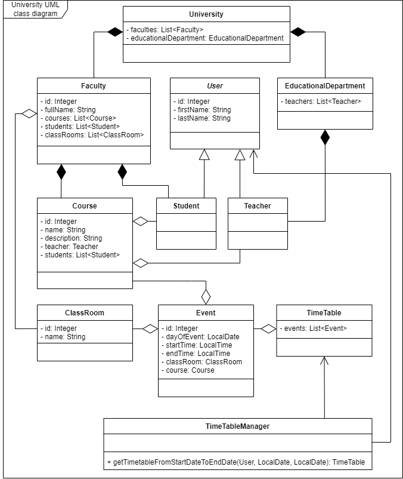

# University

### Description
This application is the *Set of Tasks* of the **Foxminded Java Spring Mentoring Program**

## Features to do
### Task 9 - Decompose university
Analyze and decompose University(create UML class diagram for application).
You should make a research and describe university structure. 
The main feature of the application is Class Timetable for students and teachers. 
Students or teachers can get their timetable for a day or for a month.
Add png image to the separate GitLab project. 
After this task, all other tasks will be in this repository so give it a meaningful name.

### Task 10 - Models
Create a JAVA project based on the University UML class diagram from the previous task.
This task requires only models implementation but additional requirements could be provided 
by your mentor. 

### Task 11 - DAO layer
Create Spring JDBC based DAO for your application.
Use Spring JdbcTemplate.

### Task 12 - Service Layer
Create a service layer and implement business logic 
(add/remove entities to other entities and save them to DB, etc). 
A mentor can provide additional business rules.
You should use Spring IoC.

### Task 13 - Exceptions and Logging
Add custom exceptions and logging. **Use slf4j + logback**

#### Tools that were used
- Oracle JDK (11.0.15.1) 
- Spring Framework (5.3.20)
- PostgreSQL (14.2) 
- H2 (2.1.212) for testing
- jUnit (5.8.2) and Mockito (4.4.0)
- Logback (1.2.11)

#### Before running...
Before running the application, do the initialization of the database. 
&emsp;&emsp;`src/main/resources/create_database.sql`

#### University UML class diagram for application

